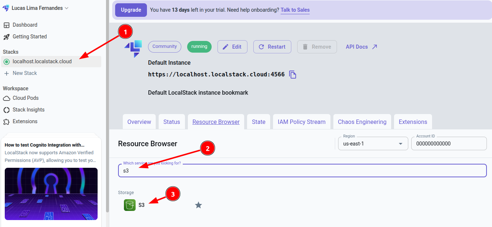
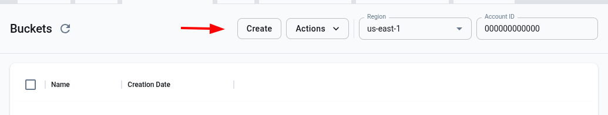
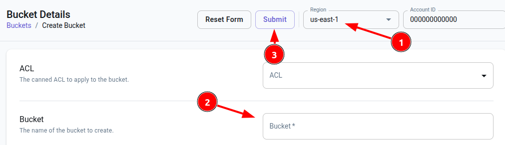
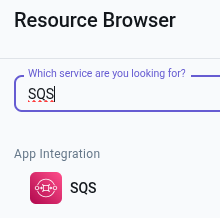
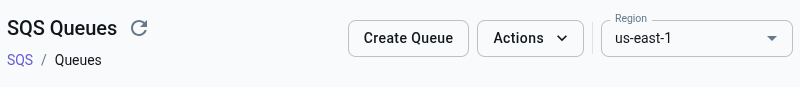
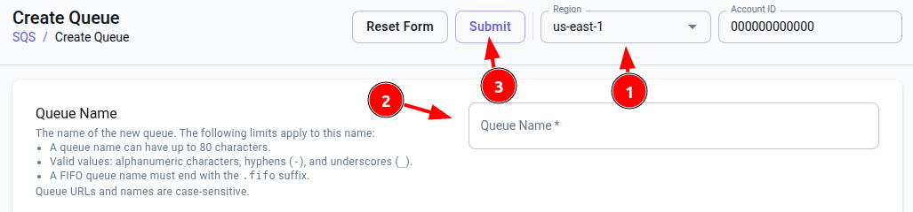

# API

Este projeto simula uma aplicação rodando em uma EC2 com FastAPI, utilizando o [LocalStack](https://github.com/localstack/localstack) para emular serviços AWS como S3 e SQS.

Autor: Lucas Lima Fernandes

## Tecnologias

- FastAPI
- LocalStack (S3, SQS)
- Docker & Docker Compose
- boto3


## Executando

### 1. Suba o LocalStack manualmente (fora do Compose)

```bash
docker network create localstack-net

docker run -d \
  --name localstack-main \
  --network localstack-net \
  -p 4566:4566 \
  -e SERVICES=s3,sqs \
  -e DEBUG=1 \
  localstack/localstack
```

### 2. Criar a queue e o bucket

Necessário possuir a cli do AWS instalada

```bash
pip install awscli
pip install awscli-local
```

#### Para cria manualmente:

```bash
awslocal s3 mb s3://lane-bucket
awslocal sqs create-queue --queue-name future-processing
```

#### Ou usando a página da LocalStack: https://app.localstack.cloud/inst/default/resources

Necessário criar conta, possuem opção **free**

1. Para o S3:

- Ao acessar a página, buscar por `S3`



- Acessar `create`



- Verificar a região, preencher o nome e criar



- Após criar, nesta página, conseguirá ver os arquivos que forem enviados.

2. Para o SQS:

- Buscar por `SQS`



- Clicar em `create`



- Verificar a região, preencher o nome e criar




### 3. Subir a api

Primeiramente, copiar o arquivo `example.env` para `.env` e preencher com os dados adequados.

```bash
docker-compose up --build
```

A API estará disponível em: `http://localhost:8080`

**Sugestão:** Usar `http://localhost:8080/docs` para acessar as routas via Swagger UI

| Método | Rota       | Descrição                       |
| ------ | ---------- | ------------------------------- |
| GET    | `/`        | Health check                    |
| GET    | `/buckets` | Lista buckets do S3             |
| POST   | `/upload/` | Faz upload de vídeo e envia SQS |


